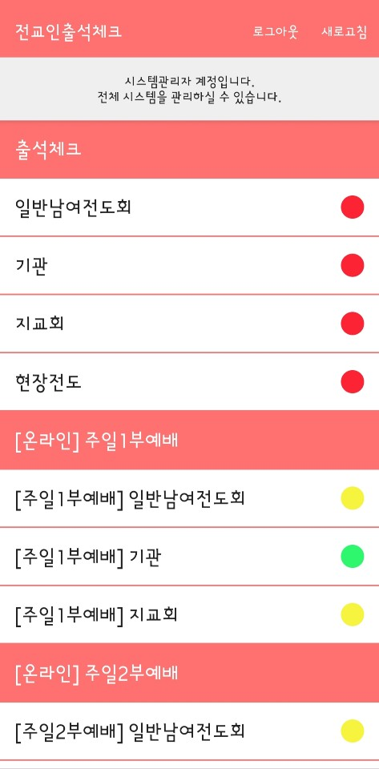

# AttendanceApp

Created: 2019-02-16

Last Updated: 2020-03-14

## Google Play

https://play.google.com/store/apps/details?id=com.jin.attendance_archive

## Screenshot

 

## Description

This is an application that helps check the attendance of worship service in the church.

[old version](https://github.com/JinSagong/AttendanceApp-OldVersion) of this application is built with Java and [the server program](https://github.com/JinSagong/AttendanceServer) can make this application work.

## Skills

* Realm
* ViewModel
* Anko (deprecated)
* Socket
* Material Design
